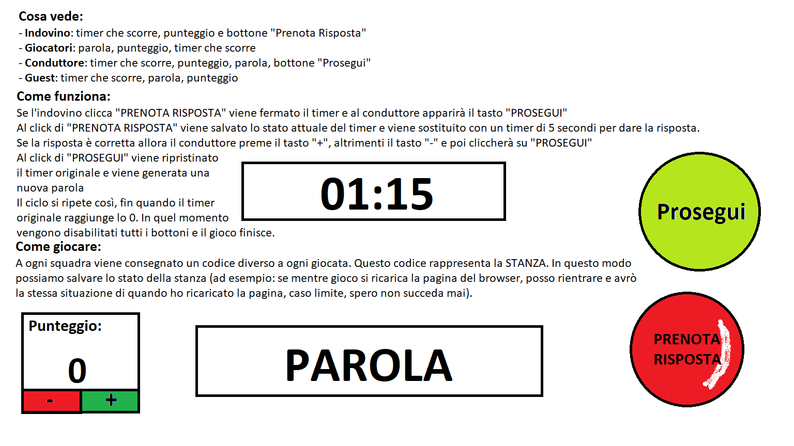
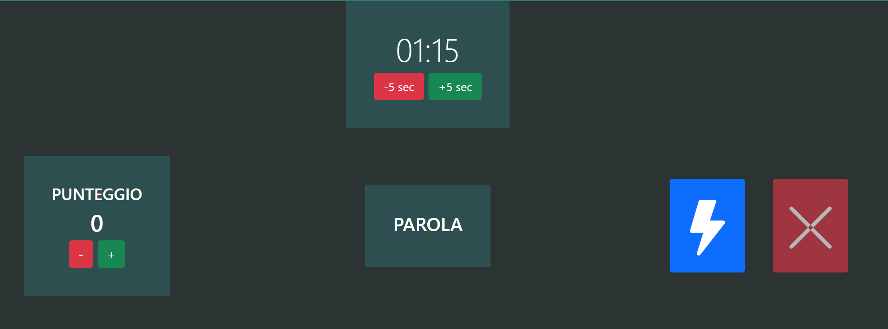
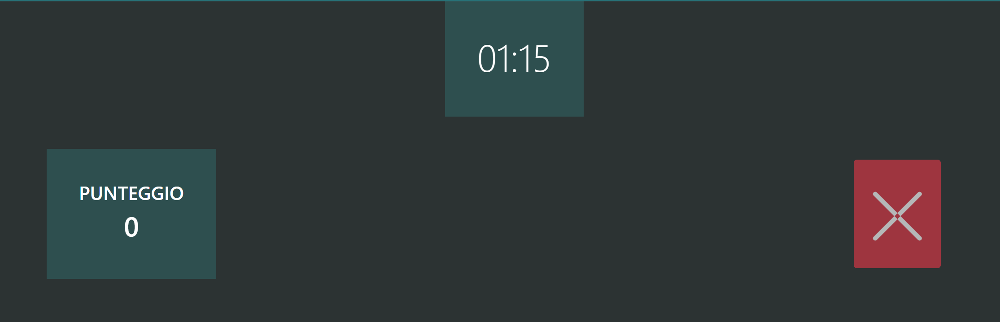
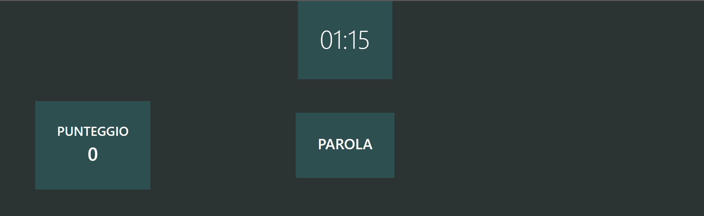

# Intesa Vincente - Reazione a Catena

## Introduzione

Intesa Vincente è un progetto open source che ha lo scopo di creare un sistema di gioco che emuli il gioco "Reazione a Catena", un programma televisivo su RAI 1.

Il progetto è online e sfrutta la tecnologia web-socket per la comunicazione in tempo reale.

## Come giocare

Per giocare è necessario collegarsi al sito [https://intesa-vincente-fd.onrender.com/](https://intesa-vincente-fd.onrender.com/)

Non è necessario autenticarsi, ma consiglio di visualizzare tramite l'apposito bottone la lista delle stanze per evitare di mettere un codice già esistente e partecipare quindi a una sessione di gioco già iniziata.

Una volta dato il nome alla stanza (codice) e scelto il ruolo che si vuole avere nella stanza si può cominciare a giocare.

## Come funziona

Per giocare c'è bisogno di una squadra composta da almeno 3 persone. 

Almeno 2 persone devono dire una parola alla volta per portare il giocatore della squadra selezionato come "Indovino" a indovinare la parola segreta.4

A ogni parola azzeccata il "Conduttore" aumenta il punteggio di 1. In caso contrario lo diminuirà.

Il gioco è a tempo, quindi quando l'Indovino crede di sapere la parola dovrà premere il bottone rosso per fermare il tempo e rispondere.

I giocatori che non sono "Indovini" entreranno nella stanza come "Spettatori" e potranno vedere il punteggio e la parola segreta.

Di seguito un piccolo schema di esempio (**nota bene**: l'immagine è da aggiornare, l'indovino è un giocatore, i compagni di squadra sono **Guest**) 



Il bottone "Prosegui" è disponibile solamente al "Conduttore" ed è di colore **BLU**.

Il bottone "Prenota Risposta" è disponibile solamente all'"Indovino" ed è di colore **ROSSO**.

## Regolamento ufficiale

Il regolamento ufficiale è disponibile al seguente [link](https://www.rai.it/dl/docs/1419868094853Reazione_a_Catena_Regolamento_2015_Versione_del_2014-12-04.pdf)

## Competitività

Il gioco è stato pensato per essere giocato in modalità competitiva, quindi è possibile creare tornei.

Tutti i dati del torneo è preferibile segnarli su carta, in modo da poter creare successivamente una classifica.

### Gestire lo spareggio

Se due squadre hanno lo stesso punteggio, si procede allo spareggio.

La gestione dello spareggio è lasciata a discrezione del "Conduttore". Infatti è possibile aggiungere secondi quando il timer è a 0. 

Ad esempio: due squadre sfidanti raggiungono il risultato di 5-5. Il "Conduttore" può decidere di aggiungere x secondi (in multipli di 5) al timer per permettere ai giocatori di rispondere a nuove domande.

## Come generare liste di parole

Per generare liste di parole è possibile utilizzare il seguente [link](https://www.palabrasaleatorias.com/parole-casuali.php?fs=1&fs2=0&Submit=Nuova+parola)

Generare una lista di parole e copiarle in un file di testo.

Il file in particolare deve essere messo dentro alla cartella "public" e deve chiamarsi "words_set_x.json" dove "x" è un numero intero **non già preso**.

Per caricare il file con le parole è possibile chiamare il seguente endpoint:

```http
GET /set-words-set/:numero-set
```

### Attenzione

Chiamando questo endpoint tutti i giocatori che usano questa istanza del software utilizzeranno il set di parole da voi scelto. **Vi consigliamo di giocare su dei vostri server.**

## Vista "Conduttore"



## Vista "Indovino"



## Vista "Spettatore"



## Lista stanze


## Cosa manca

- [ ] Aggiungere la possibilità di visualizzare i 5 secondi per rispondere (attualmente è possibile aggirare questa cosa con il timer dello smartphone)